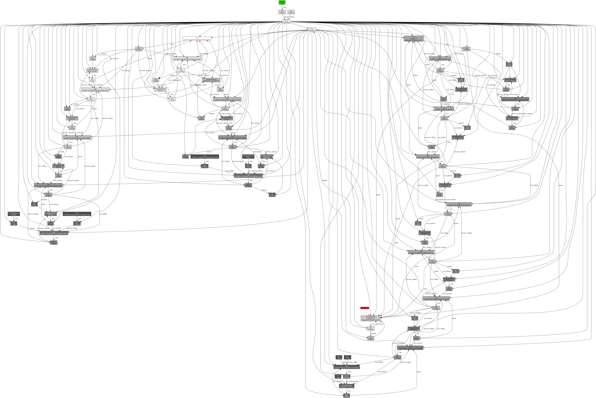

Title: Analyzing memory usage in Python 🐍 - case study
Date: 2018-07-16 10:20
Category: python
Tags: python, memoryleak, memory_profiler, pympler, objgraph, BeautifulSoup, networkx
Slug: analyzing-memory-usage-in-python
Authors: Przemysław Łada
Summary: Short version for index and feeds
Image: analyzing-memory-usage-in-python/graphana.png

Recently I've bumped into unusual situation of too much RAM usage in our python app. It was one of long running tasks which started to use more and more memory. It wasn't a problem till we used it with very heavy assignment. It effected with crush because of memory shortage (python interpreter used more then 2 GiB). Below, you can see what I saw in our Grafana dashboard:
[](images/analyzing-memory-usage-in-python/graphana.png)

First move was to carefully check code in search of obvious mistakes. Couple of optimizations was done but it didn't fix main problem. So I stepped into unknown territory of analyzing and profiling memory usage in Python.

## Measure memory usage: `memory_profiler` ##
First tool I recommend is package called `memory_profiler`([homepage](https://pypi.org/project/memory_profiler/)). You can get it with
```
pip install memory_profiler
```
and you can easily use it simply decorating your function with `@profile` decorator. Example script looks like this:
```
from io import BytesIO
from memory_profiler import profile

fp = open('memory_profiler.log', 'w+')

@profile(stream=fp)
def my_func():
    data = b'a' * 1024 * 1024 * 5  # 5 MB of data
    buffer = BytesIO(data)
    del data
    return buffer

if __name__ == '__main__':
    my_func()
```
If you run this code you will get result like this in your log file
```
Line #    Mem usage    Increment   Line Contents
================================================
     8     11.7 MiB     11.7 MiB   @profile(stream=fp)
     9                             def my_func():
    10     17.7 MiB      6.0 MiB       data = b'a' * 1024 * 1024 * 5  # 5 MB of data
    11     17.7 MiB      0.0 MiB       buffer = BytesIO(data)
    12     17.7 MiB      0.0 MiB       del data
    13     17.7 MiB      0.0 MiB       return buffer
```
### How to use `memory_profiler` with generators ###

Some methods in our app, suspected of being responsible for memory leak are generators. I had some problems decorating generator method with `@profile` decorator (there were no result given back). I read that generators are supported by **memory_profiler** library but I didn't found solution how to make it work.

As suggested in this [*stackoverflow answer*](https://stackoverflow.com/a/38050405) I've put *before* and *after* `memory_profiler.memory_usage()` method and measure memory footprint of every iteration generator produced.

## Actual size of python object: **pympler** ##
**pympler** ([homapage](https://pythonhosted.org/Pympler/)) is another great tool to measure and monitor memory behavior of python app. It have many interesting functionalities like **Muppy** which can identify if objects are leaked out of a scope between two reference points. In my case I used only great `pympler.asizeof` to investigate how much memory **NetworkX** graphs and my other object were actually using. In contrast to `sys.getsizeof` from python standard library it sizes objects recursively and can work out of the box on objects not being basic types like lists, strings or floats
```
from pympler import asizeof
print('Size of graph:', sizeof_fmt(asizeof.asizeof(networkx_graph)))
```
Logs similar to this one helped verify actual size of objects during program execution.

## Tracking references with **objgraph** ##

Python have garbage collector so problems with memory leaks usually comes from some not removed object references. Great **objgraph** is a tool which makes tracking those references an easy task. It can then present them in form of [**graphviz**](https://www.graphviz.org/) graphs.

First functionality worth mentioning of **objgraph** I used, was `objgraph.show_most_common_types()` this great feature provides quick overview of the objects in memory in form like this:
```
function                   15585
dict                       11811
tuple                      6603
list                       6182
weakref                    3387
type                       1992
getset_descriptor          1819
builtin_function_or_method 1416
Tag                        1381
NavigableString            1348
```
Using **memory_profiler** we manage to find section of code generating big memory usage. I used `objgraph.show_most_common_types(limit=10)` on this sections and logged usage on couple of program iterations. This way I found out what kind of objects were appearing in memory and where still residing there even after forced garbage collector action.
In this specific example it was **BeautifulSoup**s `Tag` and `NavigableString` class objects.

Ok, so now we know that something is wrong with removing `Tag` objects from memory by garbage collector. So we can use **objgraph** ability to show object back-references.
```
# get arbitrary Tag class object
obj = objgraph.by_type('Tag')[1000]
objgraph.show_backrefs(obj, max_depth=10, filename='sample-backref-graph.png')
```
this method can produce graph like this:
[](images/analyzing-memory-usage-in-python/sample-backref-graph.png) with our `Tag` object colored in red. This graph is quite detailed, complex and overwhelming but you can read all references from it. This graphs usually can look much simpler. More like this:
[](images/analyzing-memory-usage-in-python/sample-backref-parent-graph.png)
So you can easily get information about back-references from it.

### Memory leak connected with **BeautifulSoup** ###
In this specific example we fell into well known **BeautifulSoup** trap. In our app we were parsing some html and giving back url to images:
```
soup = BeautifulSoup(html_content, "html.parser")

for img in soup.find_all('img', src=True):
    yield generate_link(base_url, img['src'])
```
As you can see we are making **BeautifulSoup** object by parsing `html_content`. This part is quite memory consuming (depends of html size but it can be even 1-4 MiB of memory). Then we find all images and return links. Everything should end up well, and after method execution python garbage collector should remove **BeautifulSoup** object from memory because there is no more references to it. But that is known issues that expressions like this: `img['src']` returns results of type `NavigableString` instead of `str`. `NavigableString`s still have references to `Tag` object and because of that whole parsed by **BeautifulSoup** html page is still in memory even after method ends. 
On *StackOverflow* I found [great hint and easy solution](https://stackoverflow.com/a/42535781):

Simply transform `img['src']` to string by `str(img['src'])`. This way you transform `NavigableString` into standard string and loose all unnecessary references and garbage collector can work as assumed.

## NetworkX graph memory leak ##

Our app during work is building graph representing connections between web pages. We are using python library called [**NetworkX**](https://networkx.github.io/). After profiling memory usage I saw that graph was getting bigger and bigger even when no new *nodes* or *edges* were created.
In **NetworkX** you can represent *edges* by any kind of object. Also custom made, but for it to work you have to implement `__hash__` method:
```
class Link:
    def __init__(self, url: str, to_parse: bool=False):
        self.url = url
        self.to_parse = to_parse

    def __eq__(self, other):
        if isinstance(other, Link):
            return self.url == other.url
        return False

    def __ne__(self, other):
        return not self.__eq__(other)

    def __hash__(self):
        return hash(self.url)
```
and then if you try to make something like this:
```
import networkx as nx
link1 = Link('https://www.example.com/')
link2 = Link('https://www.example.com/')

graph = nx.DiGraph()
graph.add_node(link1)
graph.add_node(link2)
```
there will be only one *node* in graph.
And everything is fine. But lets analyze another case:
```
import networkx as nx
import objgraph

graph = nx.DiGraph()

def add_links(graph):
    parent1 = Link('https://www.example.com/')
    graph.add_node(parent1)
    link1 = Link('https://www.example.com/a')
    graph.add_node(link1)
    graph.add_edge(parent1, link1)

    parent2 = Link('https://www.example.com/')
    # parent2 returns same hash as parent1
    link2 = Link('https://www.example.com/b')
    graph.add_edge(parent2, link2)

add_links(graph)
objgraph.show_backrefs(objgraph.by_type('Link'), max_depth=10, filename='graph-back-refs.png')
```
At the end there will be 3 *nodes* and 2 *edge* in the graph because objects `parent1` and `parent2` return same hash. But after using `objgraph` I found out that there is  reference from graph to `parent1` but also to `parent2`. Line `objgraph.show_backrefs(objgraph.by_type('Link'), max_depth=10, filename='graph-back-refs.png')` give this graph as result (as you can see there is 4 `Link` objects not 3 referenced by `DiGraph`:
[](images/analyzing-memory-usage-in-python/graph-back-refs.png)

It was memory leak because garbage collector was unable to remove objects like `parent2` after function `add_links()` ended. Solution was to check if there already was edge in graph before creating one.

## Summary ##

This way we manage to find and fix memory leaks in our application. We reduced memory usage from *~2.5 GiB* to *138 MiB*. And our Grafana reported it this way:
[](images/analyzing-memory-usage-in-python/graphana3.png)


## List of useful links ##
Big thanks to authors of all this articles and libraries. We recommend to read all of them if you have problems with memory leaks in your python programs. 

1.  If you are not familiar with the way python garbage collector works, we strongly recommend this articles:
    1.  [Garbage collection in Python: things you need to know](https://rushter.com/blog/python-garbage-collector/)
    2.  [Memory management in Python](https://rushter.com/blog/python-memory-managment/)
    3.  And a little dusty ["Dude, Where's My RAM?" - A deep dive into how Python uses memory](https://pyvideo.org/pycon-us-2011/pycon-2011---quot-dude--where--39-s-my-ram--quot-.html)
2.  Great Case study from *Benoit Bernard*: [**Tracking Down a Freaky Python Memory Leak**](https://benbernardblog.com/tracking-down-a-freaky-python-memory-leak/)
3.  [Diagnosing Memory “Leaks” in Python](https://chase-seibert.github.io/blog/2013/08/03/diagnosing-memory-leaks-python.html) by *Chase Seibert*
4.  [**memory_profiler** official page](https://pypi.org/project/memory_profiler/)
5.  [Plot memory usage as a function of time](http://fa.bianp.net/blog/2014/plot-memory-usage-as-a-function-of-time/)
6.  [7 tips to Time Python scripts and control Memory & CPU usage](http://www.marinamele.com/7-tips-to-time-python-scripts-and-control-memory-and-cpu-usage)
7.  [**ObjGraph** - Python Object Graphs Documentation](https://mg.pov.lt/objgraph/)
8.  [**Pympler** documentation](https://pythonhosted.org/Pympler/)
